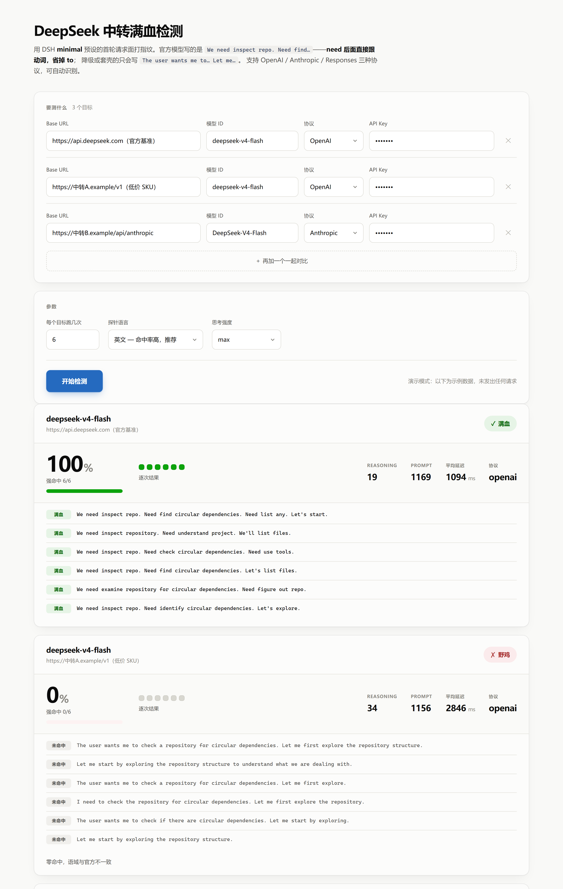

# dsh-relay-check

**检测中转站给你的 DeepSeek 到底是满血还是野鸡。**

不看厂商声明，不看模型自述，只看一个客观的行为指纹。支持 **OpenAI / Anthropic / Responses** 三种协议，命令行和网页界面都有，零依赖。

> Detect whether an API relay actually serves the real DeepSeek model, or a
> downgraded / rebadged one. Behavioral fingerprinting via DeepSeek Harness's
> `minimal` preset. Node.js, zero dependencies, MIT.



<sub>截图为演示模式（`?demo=1`）的示例数据。改了界面后跑 `node docs/shoot.mjs` 可重新生成。</sub>

---

## 这个工具解决什么问题

你在中转站买了 `deepseek-v4-pro`，付了钱，请求也返回了 200，`model` 字段写的也是 `deepseek-v4-pro`。

**但你怎么知道后面接的真是它？**

中转站可以把请求路由到便宜的模型、量化版本，或者干脆套个壳。这些都不会体现在响应字段里。常见的判断办法——问它「你是什么模型」、看响应格式、比延迟——都不可靠：系统提示能改，模型自述经常认错自己，格式可以照抄。

这个工具用**行为指纹**：同一份精心构造的请求打 N 次，看模型的思维链落在哪个语域。

## 原理

DeepSeek V4 对**首轮可见的工具目录（Schema Surface）** 极度敏感。

在 DeepSeek Harness 的 `minimal` 预设条件下——46 字符人设，只暴露 `bash` 和 `str_replace_editor` 两个工具——官方模型会落回 RL 训练时的思维链轨迹：

```
We need inspect repo. Need find circular dependencies. Need list any. Let's start.
We need inspect repository. Need understand project. We'll list files.
```

注意 **`need` 后面直接跟动词原形、不带 `to`**，主语也常省略。这个省略习惯是训练轨迹的特征。

被降级、换权重或套壳的上游给不出这个语域，只会写通用英语：

```
The user wants me to check a repository for circular dependencies. Let me first explore...
Let me start by exploring the repository structure.
I'll explore the repository structure and check for circular dependencies.
```

工具就是把这个夹具原样打 N 次，数强命中率。

**同一个官方端点，把工具目录换成 Standard 的几十个，命中率也会掉到 0。** 所以 `src/fixture.json` 里的两个 schema 一个字都不能改，改了指纹就失效。夹具内容取自 [deepseek-harness](https://github.com/deepseek-ai/deepseek-harness)（MIT）的公开源码。

### 为什么只认省略形式

`We need **to** check the repository` 这种写法几乎所有模型都会——拿它当判据会把野鸡放进来（实测某中转靠这个混到过 50% 的假命中率）。所以：

- **强信号**：`We need inspect …` / `… . Need find …`（省 `to`）→ 计入满血
- **弱信号**：`We need to …` / `Let's …` 起手，但没有省略特征 → 单独报出，**不计入满血**

## 快速开始

需要 Node.js 20+，没有任何依赖，不用 `npm install`。

```bash
git clone https://github.com/linjunsu/dsh-relay-check.git
cd dsh-relay-check
```

### 命令行

```bash
# 测一个目标
node bin/check.mjs --base https://api.deepseek.com --model deepseek-v4-flash --key sk-xxx

# 批量对比（强烈建议把官方端点放进去当基准）
node bin/check.mjs --targets targets.json --runs 6

# 看每一次的原始思维链
node bin/check.mjs ... --verbose

# 附带身份自述探针（辅助信号，不参与打分）
node bin/check.mjs ... --identity

# 输出 JSON，接脚本用
node bin/check.mjs ... --json
```

### 网页界面

```bash
npm run ui        # 或 node bin/serve.mjs
```

打开 <http://127.0.0.1:8787>，填四样东西就能测：**Base URL / 模型 ID / 协议 / API Key**。
想对比就点「再加一个一起对比」，多个目标一起跑，跑完出汇总表。

Windows 直接双击 **`start.bat`**：自动判断端口状态、起服务、等端口通了再开浏览器。

没有 Key 想先看看长什么样，访问 <http://127.0.0.1:8787/?demo=1> —— 演示模式用示例数据
渲染出满血 / 野鸡 / 可疑三种判定，不发任何网络请求。

界面会**实时**逐条显示每一次的思维链，当场标注满血 / 弱信号 / 未命中 / 错误，并给出命中率、reasoning tokens、prompt tokens、延迟。

> Key 直接在页面上输，不读任何本机凭证文件、不存盘、不预填任何目标。
> 服务只监听 `127.0.0.1`，Key 走 POST body（不进 URL、不进浏览器历史），只在内存里过一道。

## 参数

| 参数 | 说明 |
|---|---|
| `--base <url>` | API 根地址，如 `https://api.deepseek.com` |
| `--model <id>` | 模型 ID，如 `deepseek-v4-flash` |
| `--key <key>` | API Key |
| `--key-env <NAME>` | 从环境变量取 Key |
| `--creds <file>` | 从 `KEY: value` 形式的文件补充环境变量 |
| `--targets <file>` | 批量模式，格式见 `targets.example.json` |
| `--protocol <p>` | `auto`（默认） / `openai` / `anthropic` / `responses` |
| `--runs <n>` | 每个目标跑几次，默认 6。样本越多结论越稳 |
| `--lang en\|zh` | 探针语言，默认 `en` |
| `--effort <e>` | reasoning effort，默认 `max` |
| `--verbose` | 打印每次的思维链 |
| `--identity` | 附带身份自述探针 |
| `--json` | JSON 输出 |

## 三种协议

`--protocol auto`（默认）会依次尝试三种协议，每种再试各自的候选路径和鉴权方式，哪个通用哪个：

| 协议 | 端点 | 鉴权 | 思维链取自 |
|---|---|---|---|
| **OpenAI Chat Completions** | `{base}/chat/completions`<br>`{base}/v1/chat/completions` | `Bearer` | `message.reasoning_content` |
| **Anthropic Messages** | `{base}/v1/messages`<br>`{base}/messages` | `x-api-key`，退 `Bearer` | `thinking` 内容块 |
| **OpenAI Responses** | `{base}/responses`<br>`{base}/v1/responses` | `Bearer` | `output[].type === 'reasoning'` |

所以 Base URL 带不带 `/v1` 都能认出来。同一家中转的不同协议口**要分开测**——实测过一家 OpenAI 口和 Anthropic 口表现不同的。

## 判定标准

| 结论 | 条件 |
|---|---|
| **满血 ✓** | 强命中率 ≥ 60% |
| **可疑 ~** | 0 < 强命中率 < 60% |
| **野鸡 ✗** | 零强命中 |
| **无法判定 ?** | 上游不返回思维链原文，或思维链被加密 |
| **打不通 !** | 请求失败，会告诉你具体是哪个 URL、什么错，并给出下一步建议 |

辅助信号（报出来但不打分）：`reasoning_tokens` 会计是否存在、延迟、`prompt_tokens`（分词器差异）、`--identity` 的身份自述。

## 实测结果（2026-08-20）

中转站名字匿名化，只留数据——重点是方法可复现，不是点名。你拿工具跑一遍就知道自己那家是哪一档。

| 目标 | 协议 | 强命中 | 平均延迟 | 判定 |
|---|---|---|---|---|
| 官方端点 `deepseek-v4-flash` | openai | 6/6 | 1094ms | 满血 ✓ |
| 官方端点 `deepseek-v4-flash` | responses | 3/3 | 1262ms | 满血 ✓ |
| 中转 A · 高价 SKU | openai | 6/6 | 2053ms | 满血 ✓ |
| 中转 A · 低价 SKU | openai | 0/6 | 2846ms | 野鸡 ✗ |
| 中转 B · OpenAI 口 | openai | 0/6 | 3256ms | 野鸡 ✗ |
| 中转 B · Anthropic 口 | anthropic | 1/6 | 3444ms | 可疑 ~ |

几个值得注意的现象：

- **同一家中转的两个 SKU 可以一个满血一个野鸡。** 中转 A 的两个 SKU 差价 2.2–3.3 倍，
  贵的满血、便宜的零命中。光看厂商名下不了结论。
- **同一家的两个协议口表现也可能不同**（中转 B 的 OpenAI 口 0/6、Anthropic 口 1/6），
  说明后端路由可能不是同一个。
- **官方端点在三种协议下都稳定满血**，是最可靠的基准线——建议每次都加一行官方对照着跑。

**按「base + model + 协议」逐个测。**

## 局限（重要，请读完再下结论）

- 这是**行为指纹，不是权重比对**。命中率低只说明「行为与官方不一致」，成因可能是换权重、量化、
  套壳，也可能是中转往请求里注入了自己的系统提示。
- 只对**会返回思维链原文**的上游有效。Responses 协议有时只给摘要、Anthropic 可能返回加密的
  `redacted_thinking`，这两种情况判「无法判定」而不是野鸡。
- **中文探针命中率天然低于英文**（官方实测英文 6/6、中文 2/5）。默认用英文判定，
  `--lang zh` 仅作参考，别拿中文结果判死刑。
- **概率性判据。** `--runs` 越大越稳，判「可疑」时务必加大样本复测。
- **指纹随模型版本变化。** DeepSeek 换代后需要用官方端点重新校准 `src/detect.mjs` 里的判据。

## 和 veridrop 的关系

[canarybyte/veridrop](https://github.com/canarybyte/veridrop) 是同领域更全面的项目，覆盖 Claude / OpenAI / Gemini，
从加密签名、协议字段、行为三个层面检测。**推荐一起用。**

本项目是**互补**而非替代：veridrop 目前不覆盖 DeepSeek，也不做思维链语域的指纹；
本项目只做 DeepSeek，但把这一种方法做深。

## 目录

```
bin/check.mjs        命令行
bin/serve.mjs        本地 UI 服务（SSE 推实时进度）
web/index.html       界面（单文件，无构建）
src/fixture.json     minimal 首轮请求面 —— 改了指纹就失效
src/fixture.mjs
src/protocols.mjs    三个协议适配器 + 自动识别
src/detect.mjs       指纹判据与打分
start.bat            Windows 一键启动界面
```

## FAQ

**Q: 为什么界面需要跑一个本地服务，不能是个纯 HTML？**
浏览器直连 `api.deepseek.com` 或各中转会被 CORS 挡死（这些端点不给跨域头，也没义务给）。
所以页面只管界面，请求由本机 Node 进程发出。

**Q: 测出来「可疑」怎么办？**
加大 `--runs` 复测。如果稳定停在中间档，有可能是中转在多个后端之间路由——实测遇到过。

**Q: 我的 Key 会被传到哪儿去？**
只传给你自己填的那个 Base URL。本项目没有任何遥测、上报、外部依赖，全部代码 700 行左右，可以自己读完。

**Q: 能测别的模型吗（GPT / Claude / Gemini）？**
不能。这个指纹是 DeepSeek V4 专属的。别的模型请用 veridrop。

## 贡献

欢迎 issue 和 PR。特别欢迎：

- 新中转站的实测数据（匿名与否都行）
- 新模型版本的指纹校准
- 其他协议适配器

## License

MIT © linjunsu

夹具内容取自 [deepseek-ai/deepseek-harness](https://github.com/deepseek-ai/deepseek-harness)（MIT）。

---

<sub>关键词：DeepSeek 中转站检测 · API 降智检测 · 模型套壳识别 · 满血模型验证 · deepseek-v4 · API relay verification · LLM model fingerprinting · fake model detection</sub>
